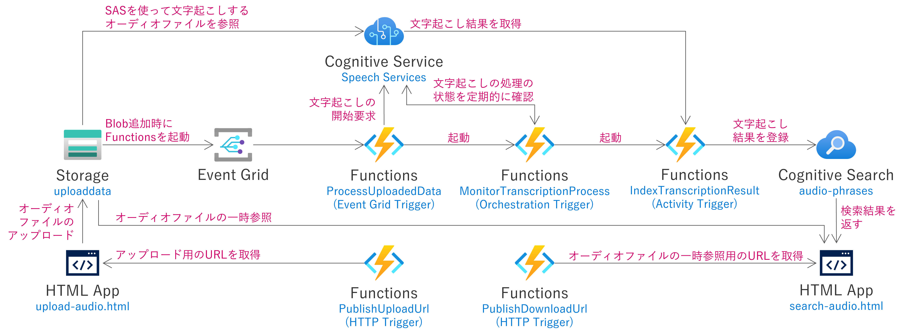

# Azure での文字列でのオーディオファイルの検索
- このソリューションを使うことで、オーディオファイルを文字列で検索することができます
- Azure Cognitive Services の Speech Services を使用することで、オーディオファイル(WAVのみ)の文字起こしをします
- 文字起こしの結果を Azure Cognitive Search へ登録することで、指定した文字列でオーディオファイルのどの時点で話した内容かを検索することができます

## 必要な環境
- [Azure CLI](https://docs.microsoft.com/ja-jp/cli/azure/install-azure-cli)
- [Azure Bicep](https://docs.microsoft.com/ja-jp/azure/azure-resource-manager/bicep/install)
- [.NET 6.0](https://dotnet.microsoft.com/ja-jp/download/dotnet/6.0)
- [Azure Functions Core Tools ](https://learn.microsoft.com/ja-jp/azure/azure-functions/functions-run-local)

## デプロイ方法

Azure CLI で Azure テナントへログインし、使用するサブスクリプションを選択します。
```bash
az login
az account set --subscription "xxxxxxxx-xxxx-xxxx-xxxx-xxxxxxxxxxxx"
```

> 参考：[Azure CLI を使用して Azure サブスクリプションを管理する方法](https://learn.microsoft.com/ja-jp/cli/azure/manage-azure-subscriptions-azure-cli)

環境を構築するために、```deploy.sh```スクリプトを実行します。
```bash
./deploy.sh [リソースグループ名]
# 例： ./deploy.sh rg-speech-search
```

## 展開される Azure アーキテクチャ


